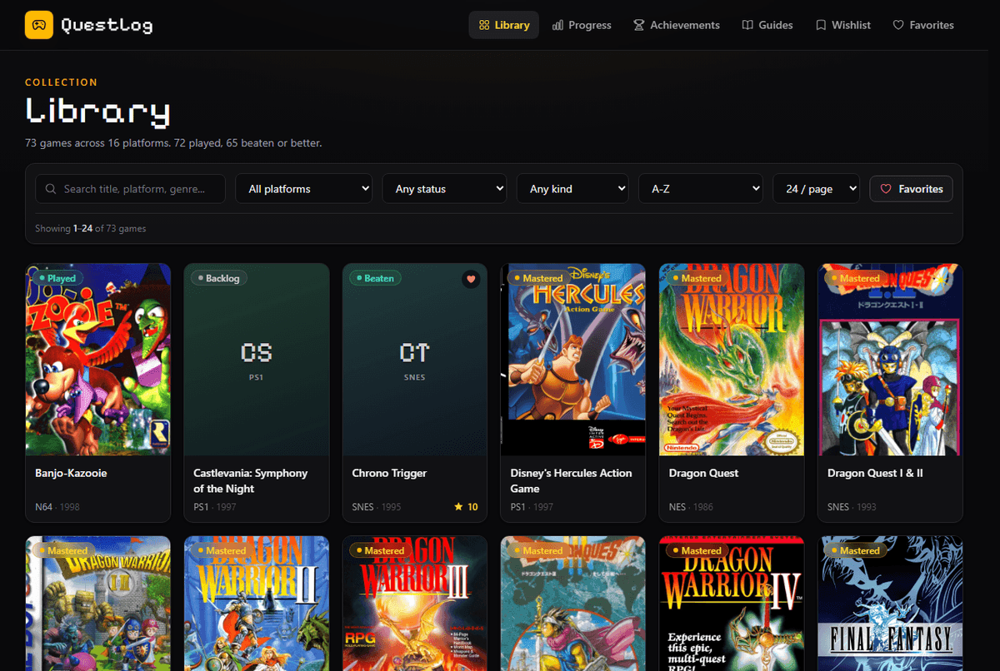
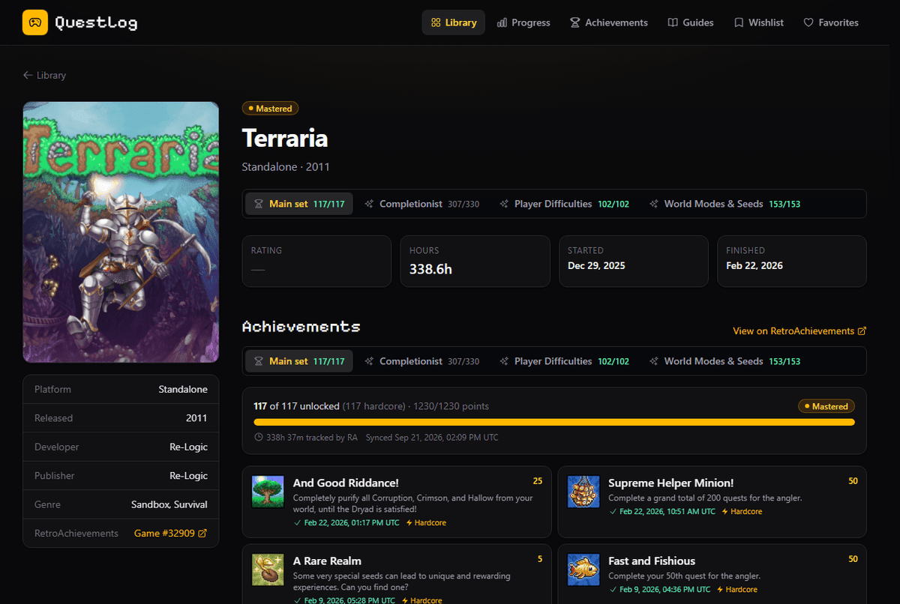
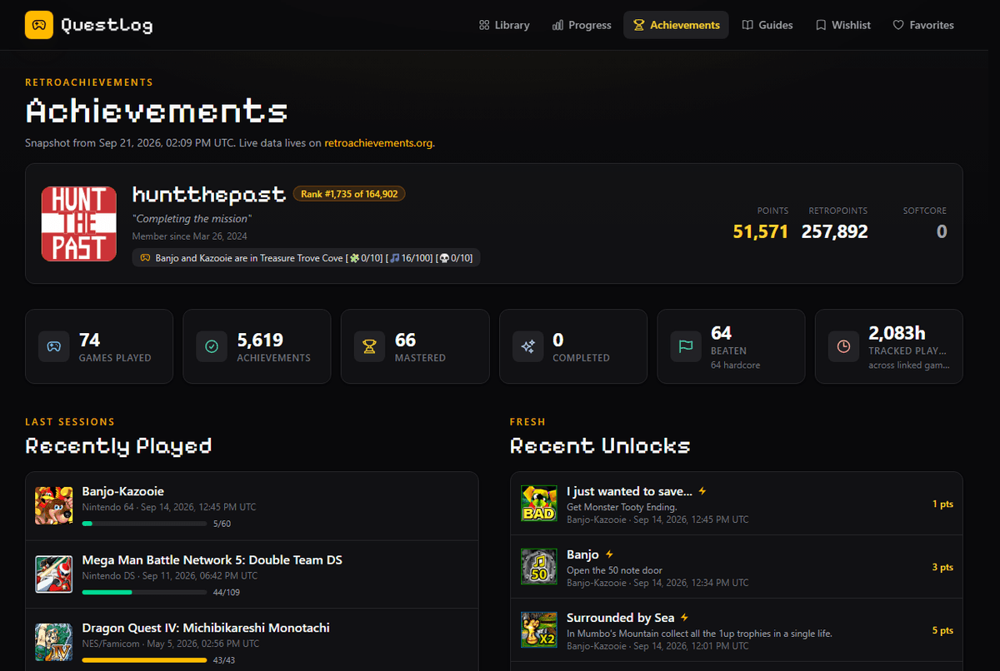
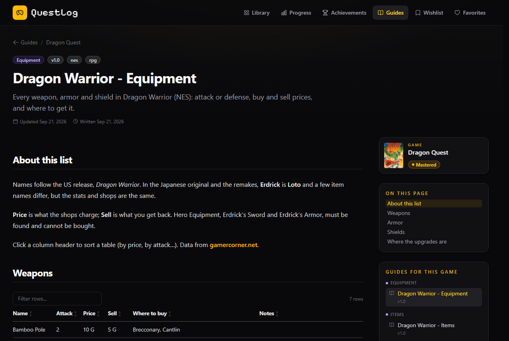
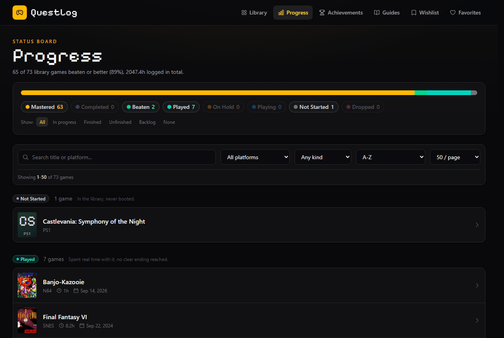

<div align="center">

# QuestLog

**A self-hosted game journal: library, progress, RetroAchievements + Steam achievements, and your own walkthroughs.**
Static site, no backend, edited through a local-only admin that never leaves your machine.

[**Live site**](https://hunt-the-past-questlog.vercel.app) ·
[Screenshots](#screenshots) ·
[Quick start](#quick-start) ·
[How it works](#where-the-data-lives)

[](https://github.com/huntthepast/Hunt-The-Past-Questlog/actions/workflows/build.yml)
[](LICENSE)
[](LICENSE-CONTENT.md)




</div>

Hunt the Past's game journal: a public, fully static website (Astro + Tailwind CSS v4 + Alpine.js) that tracks

- the games I own and have played (library),
- the games I want to play (wishlist),
- my all-time favorites,
- my RetroAchievements profile, unlocks, masteries and per-game achievement progress - plus Steam and hand-made
  achievement sets, shown as tabs on the same game page,
- where every game stands: playing, on hold, played, beaten, completed, mastered, dropped,
- my own walkthroughs, cheat lists, tips, reviews, notes and missable / collectible trackers.

The public site has **no backend**. Everything it shows is read at build time from JSON and Markdown files in this
repository, so it deploys to Vercel as plain static files.

Editing happens through a **local-only admin** (`npm run admin`) that runs on your own computer, writes those files for
you, syncs RetroAchievements and Steam, and can commit + push when you are ready. It binds to `127.0.0.1`, is never
deployed, and is the only place your API keys are ever used.

```
 you  ──>  local admin (127.0.0.1:3333)  ──writes──>  src/content/*, src/data/*  ──git push──>  GitHub  ──>  Vercel (astro build)
                      │
                      └── RetroAchievements / Steam APIs (keys stay in .env on your machine)
```

## Screenshots

| Game page: achievement sets as tabs | Achievements: profile, shelf, per-game progress |
| --- | --- |
| [](docs/screenshots/game.png) | [](docs/screenshots/achievements.png) |
| **Guides: sortable tables, checklists, sidebar** | **Progress: status board with filters** |
| [](docs/screenshots/guide.png) | [](docs/screenshots/progress.png) |


## Quick start

```bash
npm install
cp .env.example .env      # optional: fill in RA_USERNAME / RA_API_KEY for RetroAchievements
npm run dev               # public site with live reload  -> http://localhost:4321
npm run admin             # local admin                   -> http://127.0.0.1:3333
```

Requires Node 22.12 or newer.

| Script              | What it does                                                                 |
| ------------------- | ---------------------------------------------------------------------------- |
| `npm run dev`       | Astro dev server for the public site                                         |
| `npm run build`     | Production build into `dist/` (this is all Vercel runs)                      |
| `npm run preview`   | Serve the production build locally                                           |
| `npm run check`     | Type-check the Astro/TypeScript code                                         |
| `npm run admin`     | Compile the admin stylesheet and start the local admin server (auto-restarts when its code changes) |
| `npm run admin:css` | Only rebuild the admin stylesheet (Tailwind CLI)                             |

## Daily workflow

1. `npm run admin` and open <http://127.0.0.1:3333>.
2. Add or edit games, guides and trackers. Every save writes straight into the repo (see "Where the data lives").
3. Optionally open **RetroAchievements → Sync now** to refresh your profile snapshot and achievement lists.
4. Run `npm run dev` in another terminal if you want to preview at <http://localhost:4321>.
5. Go to **Publish**: optionally run the test build, then **Commit all & push**. Vercel rebuilds automatically.
   (Or just `git add -A && git commit -m "..." && git push` yourself.)

## Where the data lives

```
src/content/games/<slug>.json      one file per game (library and wishlist)
src/content/guides/<slug>.md       markdown guides with YAML frontmatter
public/guides/<slug>/              images (maps etc.) uploaded through the admin for that guide
src/content/trackers/<slug>.json   checklists (missables, collectibles, bosses, ...)
src/content/ra-games/<id>.json     RetroAchievements per-game snapshots (written by the admin sync)
src/content/achievement-sets/*.json Steam sets (written by the Steam sync) and manual sets (GOG, consoles...)
src/data/site.json                 site title, tagline, owner, about text, footer links
src/data/platforms.json            platform list (+ RetroAchievements console ids for auto-matching)
src/data/ra-profile.json           RetroAchievements profile snapshot (written by the admin sync)
src/data/shelf.json                manual trophy-shelf order / hidden badges (empty = follow RA)
public/covers/                     cover images uploaded through the admin
```

You can also edit these files by hand; the schemas in `src/content.config.ts` validate them at build time.

### Game

(The `//` comments below are only for illustration; real JSON files cannot contain them.)

```json
{
  "title": "Chrono Trigger",
  "platform": "snes",
  "cover": "/covers/chrono-trigger.jpg",
  "genres": ["RPG"],
  "developer": "Square",
  "publisher": "Square",
  "releaseYear": 1995,
  "ownership": "owned",          // owned | wishlist
  "favorite": true,
  "status": "beaten",            // unplayed | playing | on-hold | played | beaten | completed | mastered | dropped
  "rating": 10,                  // 0-10
  "hoursPlayed": 28,
  "startedAt": "2026-06-02",
  "finishedAt": "2026-07-14",
  "raGameId": 1234,              // retroachievements.org/game/1234 - enables achievement sync
  "steamAppId": 105600,          // store.steampowered.com/app/105600 - enables the Steam achievement sync
  "subsets": [                  // your journal for RA subsets of this game (their achievements come from the sync)
    { "raGameId": 5678, "rating": 8, "hoursPlayed": 12.5, "startedAt": "2026-07-01", "finishedAt": "2026-07-20", "review": "Markdown", "notes": "Markdown" }
  ],
  "review": "Markdown allowed.",
  "notes": "Where I left off...",
  "tags": ["classic"],
  "addedAt": "2026-09-18T12:00:00.000Z",
  "updatedAt": "2026-09-18T12:00:00.000Z"
}
```

Statuses, guide types and tracker types are defined once in `src/lib/constants.js` and shared by the site and the admin.

A tag of `hack`, `homebrew`, `prototype`, `demo`, `unlicensed` or `test-kit` marks the kind of release (RetroAchievements' "~Hack~" style
title prefixes become these tags on import); the Library and Progress pages get a **kind** filter (Official / Hack / Homebrew...)
whenever the library mixes kinds.

### Guide

Markdown (GitHub-flavored: tables, task lists, footnotes) with frontmatter:

```md
---
title: "Chrono Trigger - Maps"
type: "Maps"                 # free text: Walkthrough, Maps, Items, Persona List... guides of a game are grouped by it
game: "chrono-trigger"      # optional link to a game slug
summary: "Every area map in one place."
version: "1.0"              # optional, GameFAQs-style
order: 1                    # position inside its type group (lower first)
series: "Main walkthrough"  # optional: guides of this game with the same series name get previous/next links, in `order`
tags: ["snes"]
draft: false
gallery:                    # optional image wall shown above the text, with a full-screen viewer
  - src: "/guides/chrono-trigger-maps/guardia-forest.png"
    title: "Guardia Forest"
    caption: "600 AD"
    category: "Overworld"   # optional: groups the wall into sections (Overworld, Towns, Dungeons...)
downloads:                  # optional buttons in the sidebar (e.g. a zip attached to a GitHub release)
  - label: "All maps (zip)"
    url: "https://github.com/<you>/<repo>/releases/download/v1/maps.zip"
createdAt: "2026-09-19T09:00:00.000Z"
updatedAt: "2026-09-19T09:00:00.000Z"
---

## Part 1: Guardia Forest

### Map


### Checklist
- [ ] Power Tab in the lower clearing

### Walkthrough
...
```

Every guide of a game is listed in a sidebar on each of that game's guide and tracker pages (grouped by type),
so a reader can jump from the walkthrough to the item list or the map gallery. A multi-part guide (Part 1 / 2 / 3)
gets **previous / next** links at the bottom of each part when the parts share a `series` name - only that name
chains guides, so a differently named walkthrough, an item list or a tracker is never pulled in. Headings become
the page's table of contents (`##` entries, with `###` entries shown only under the section being read);
`- [ ]` task lists are tickable by readers (saved in their browser), collapsible, and can be laid out in
1-3 columns - the guide's **Checklist layout** and **Collapse checklists by default** settings are the starting point, and
readers can change both for themselves. Images uploaded through the
admin's **Gallery** dialog land in `public/guides/<slug>/`; the **Template** button inserts the
walkthrough skeleton (intro, controls, characters, one map + checklist + walkthrough block per area, credits),
and **Link to guide** inserts links to another guide's sections; **Outline** lists every heading of the body and jumps the
editor to it, and **Tick all / Untick all** flip the `- [ ]` lines in the selection (or the checklist under the cursor).
Links in a guide, review or note that point off-site open in a new tab (`isExternalUrl` in `src/lib/constants.js`
decides); links within the site and `#anchors` stay in the same tab. Off-site links also carry a small arrow, so
the new tab is no surprise. The admin's **Link** button inserts either kind: one of your guides (or a section of it),
or any other address. Clicking any image opens a lightbox that pages through every image on the page. Gallery images with a `category`
are grouped under a heading of that name (in the order the categories first appear); ones without a category come
first, with no heading. Markdown tables are interactive on the site: click a header to sort (prices like
"1,200 G" sort as numbers), columns with a few repeated values (Type, Location...) get filter chips, and tables with six or
more rows get a search box - the **Table** dialog in the admin can also turn rows pasted from a spreadsheet into a table.

### Tracker

```json
{
  "title": "Chrono Trigger - Missables",
  "type": "missables",      // missables | collectibles | sidequests | achievements | bosses | checklist
  "game": "chrono-trigger",
  "checklistColumns": 1,      // 1-3: how items are laid out (the admin's "Item layout")
  "checklistCollapsed": false, // start with every section folded up
  "sections": [
    { "title": "1000 AD", "items": [ { "id": "power-tab", "label": "Power Tab - Guardia Forest", "note": "...", "done": true } ] }
  ],
  "createdAt": "...", "updatedAt": "..."
}
```

On the public site a tracker shows your progress, and visitors can switch to "My own progress" to tick items for
themselves (stored only in their browser's localStorage). Each section can be collapsed (its header shows the done
count for whichever progress is displayed) and has **Tick all / Clear** shortcuts in "My own progress"; the items can
be shown in 1-3 columns. `checklistColumns` and `checklistCollapsed` are the starting point, readers can change both
for themselves. Guide checklists (`- [ ]` lists) get the same Tick all / Clear per list. In the admin, a tracker with
several sections opens folded: the sticky **Sections** button opens a side panel that jumps to (and unfolds) any section, and each section header
has its own done count with Tick all / Clear.

## RetroAchievements

1. Copy `.env.example` to `.env` and set `RA_USERNAME` and `RA_API_KEY`
   (retroachievements.org → Settings → Keys → *Web API Key*). `.env` is git-ignored.
2. Restart `npm run admin`, open the **RetroAchievements** tab and click **Sync now**.

A sync:

- writes your profile, rank, points, recent unlocks (last 60 days), per-game completion and awards to
  `src/data/ra-profile.json`;
- for every library game with a `raGameId`, writes the full achievement list with your unlock dates to
  `src/content/ra-games/<id>.json` (shown on that game's page, including missable / progression markers);
- fills in missing cover art, developer, publisher, genre and release year on those games (never overwrites what you typed);
- with **Update hours played** enabled (default), sets `hoursPlayed` from RA's tracked playtime for each linked game. RA only
  counts sessions played while the emulator was connected, so the sync only ever raises the number and never lowers hours
  you logged yourself;
- with **Auto-upgrade statuses** enabled, promotes games to Beaten / Completed / Mastered from your RA awards (never downgrades);
- with **Fill in dates** enabled (default), fills an empty *Started* with the date of your first unlock in the game and an empty
  *Finished* with the date of your beaten / completed / mastered award - RA has no "first played" date, so the first unlock is the
  closest thing. Dates you typed are never changed. The same goes for subset journal rows;
- picks up RA **subsets** ("Game [Subset - Bonus]", the challenge / rare-drop / speedrun sets) of your linked games and stores them
  as `ra-games/<subsetId>.json` with `parentGameId`. The site shows them as tabs on the main game's page (like retroachievements.org)
  instead of as separate library games; links from the Achievements page open the right tab.

Other RA helpers in the admin:

- **Fetch** next to the RA game id in the game editor pre-fills title, platform, box art, developer, publisher, genre and year.
- **Find games to import** lists every game in your RA history that is not in the library yet and creates entries for the ones you pick
  (subsets of games you already have are skipped - the sync attaches those to the main game).
- **Subsets in the library** appears when a subset was imported as its own game: **Merge** moves its rating / hours / dates into the
  main game's `subsets` journal, re-points its guides and trackers at the main game, and removes the duplicate entry (the main
  game's own stats, status and notes are not touched). The game editor then shows a **Subsets** box to edit those per-subset stats;
  on the site the rating / hours / started / finished tiles and the review / notes switch together with the achievement tabs.
- **Import RA console list** adds RA systems to `platforms.json` so imports map to the right platform automatically.
- **Trophy shelf** (bottom of the RetroAchievements tab) arranges the badge wall shown on the Achievements page. By default it
  mirrors your RA profile order (what you set with "Reorder Site Awards" on RA); drag rows, use the arrows or hide badges to
  arrange it by hand instead. Saved in `src/data/shelf.json`; "Follow RA order" clears it.

The public site only ever reads the JSON snapshots, so the API key never leaves your machine and the site keeps
working even if RetroAchievements is down.

## Steam and other achievement sets

Games can carry achievement sets from more than one source; each one is a tab on the game page next to the
RetroAchievements set (with the same progress card, unlocked-first order and per-set stats journal).

- **Steam** - put a free Web API key (<https://steamcommunity.com/dev/apikey>) and your SteamID64 in `.env` as
  `STEAM_API_KEY` / `STEAM_ID`, set the profile's *Game details* to public, restart the admin and use
  **Achievements -> Steam -> Sync now**. Every library game with a `steamAppId` gets
  `src/content/achievement-sets/<slug>-steam.json`: the full list with your unlock dates, icons, global rarity and Steam's
  playtime. Hours / dates / status follow the same rules as the RA sync (never lowered, never overwriting what you typed);
  they go to the game itself unless the game is also on RA, in which case they go to the Steam set's own journal.
  **Import games from your Steam library** creates entries (PC platform, box art, developer, genres, year, hours) for
  games you don't have yet, and **Fetch** next to the Steam app id in the game editor pre-fills metadata.
- **Manual sets** (GOG, consoles, anything without an API) - **Achievements -> New set**: pick the game, give the tab
  a label, then type the achievements in, paste them in bulk (`Title | Description` per line) or **Import list from
  Steam** by app id (GOG copies usually share the list) and tick what you have unlocked. Hidden achievements are masked
  on the site until unlocked.

## Search engines

The build emits `sitemap-index.xml`, `robots.txt` (pointing at it), canonical URLs, Open Graph / Twitter cards with a
default share image (`public/og-default.png`) and JSON-LD structured data (`WebSite`, `VideoGame` + your review rating
on game pages, `Article` on guides, `BreadcrumbList` everywhere). Page titles and descriptions are generated from the
data in `src/lib/seo.ts`.

To get indexed rather than waiting for Google to find the site on its own:

1. Open [Google Search Console](https://search.google.com/search-console), add the site as a **URL prefix** property
   and choose the **HTML tag** verification method.
2. Paste the `content` value of that tag into **Settings -> Google Search Console verification code** in the admin,
   publish, then click **Verify** in Search Console.
3. In Search Console go to **Sitemaps** and submit `sitemap-index.xml`. Use **URL inspection -> Request indexing**
   for pages you want picked up quickly.
4. Link to the site from places you control (RetroAchievements profile, GitHub profile). A couple of real links matter
   more than anything on-page.

If you attach a custom domain on Vercel, update `site` in `astro.config.mjs` so canonicals, the sitemap and share
images point at it.

## Deploying to Vercel

1. Push this repository to GitHub (it can be public: secrets live only in `.env`, which is ignored).
2. In Vercel, **Add New Project → Import** the repo. The Astro preset is detected automatically
   (build command `npm run build`, output directory `dist`). No environment variables are needed.
3. Every push to `main` triggers a new build. Set `site` in `astro.config.mjs` to your final URL so canonical and
   Open Graph tags are correct.

`admin/` is listed in `.vercelignore` and is never started by Vercel: the deployment is just the `dist/` folder.

## Dialogs

Confirmations use [SweetAlert2](https://sweetalert2.github.io/) instead of the browser's own `confirm()`, on the site
and in the admin alike. The helpers live in [`src/lib/dialogs.js`](src/lib/dialogs.js) (`confirm`, `danger`, `alert`,
`prompt`, `toast`) and the look in [`src/styles/swal.css`](src/styles/swal.css); the admin loads the same module from
`/vendor/dialogs.js`, so both sides stay identical. Destructive actions get the red `danger` variant with the cancel
button focused.

## Security notes on the admin

- Listens on `127.0.0.1` only; requests with a foreign `Host` header are rejected (DNS-rebinding guard) and
  cross-site form posts are blocked (CSRF middleware). It is meant to be run on your own machine while you use it.
- Slugs are validated (`a-z`, `0-9`, `-`), uploads are limited to PNG/JPEG/WebP/GIF under 8 MB, and file paths are
  always resolved inside the repo.
- The API key is read from `.env` and never returned by any endpoint.

## Project layout

```
admin/                 local admin (Hono server + Alpine.js UI, Tailwind via CLI)
  server.js            routes: /api/games, /api/guides, /api/trackers, /api/ra/*, /api/git/*, /api/site, /api/platforms
  lib/                 store (file I/O), schemas (zod validation), ra (RetroAchievements client + sync), git, slug
  public/              admin UI (index.html, app.js) - styles.css is generated and git-ignored
src/
  alpine.ts            Alpine components used by the public site (list filtering, tracker "my progress" mode)
  content.config.ts    content collection schemas (games, guides, trackers, raGames)
  lib/                 constants.js (shared vocabulary), data.ts (queries/formatting), ui.ts (color maps)
  layouts/, components/, pages/, styles/global.css
```

## Making the repository findable

Everything below lives in GitHub's settings rather than in the code, so it has to be done once, by hand:

1. **About box** (repo home page, the gear next to "About"):
   - Description: `A self-hosted game journal: library, progress, RetroAchievements + Steam achievements and your own
     walkthroughs. Static Astro site, local-only admin, no backend.`
   - Website: `https://hunt-the-past-questlog.vercel.app`
   - Topics: `astro`, `tailwindcss`, `alpinejs`, `retroachievements`, `steam-api`, `game-tracker`,
     `game-collection`, `backlog`, `walkthroughs`, `static-site`, `self-hosted`, `gaming`
   - Tick "Releases" and "Packages" off if they stay empty; leave "Deployments" on (Vercel fills it).
2. **Social preview** (Settings -> General -> Social preview -> Edit): upload
   [`docs/social-preview.png`](docs/social-preview.png). That is the card people see when the link is shared on
   Discord, Reddit, X or Bluesky; without it they get a grey placeholder.
3. **Pin the repository** on your GitHub profile, and put the live URL in your profile bio and your
   RetroAchievements profile - a couple of real links matter more than anything on-page.
4. Optional: a short post in the places where this kind of thing gets found - r/selfhosted, r/retrogaming,
   the RetroAchievements Discord, the Astro "Showcase" channel. Lead with a screenshot.

The screenshots in this file are regenerated with a headless browser against `npm run preview`; the social card is
composed from `docs/screenshots/library.png`.

## License

- **Code** (everything that builds the site: `src/`, `admin/`, config): [MIT](LICENSE) - use it however you like,
  keep the copyright notice.
- **Content** (guides, trackers, reviews, notes, the site's text): [CC BY 4.0](LICENSE-CONTENT.md) - free to copy,
  adapt and even use commercially **as long as you credit Hunt the Past and link back**.
- Game names, box art, RetroAchievements and Steam data, and third-party reference data used in individual guides
  are **not** covered - see [LICENSE-CONTENT.md](LICENSE-CONTENT.md) for the details and the credits.

The site footer states this too, so readers see it without opening the repository.

### Crediting other people, and taking their work down

Guides often build on someone else's work - a map archive, a wiki, a fan site's item tables. Each guide and
tracker carries a `sources` list (name, link, note, licence), edited in the admin under **Sources & credits**:

```yaml
sources:
  - label: "Better VGMaps"
    url: "https://vgmaps.de/maps/nes/dragon-warrior"
    note: "Maps drawn by Chiasm and Rick Bruns; linked, not copied."
    license: "CC BY-SA"
```

Nothing is detected automatically - you name the source yourself. To save retyping, the dialog offers every
source credited anywhere as a one-click reuse (name and licence carry over; the note stays empty because it
describes what *this* page took), and the admin's **Sources** section lists them all with the pages that cite
them, so one click opens the page in the editor. It also flags the one mistake that matters: the same site
credited under two spellings, which `/credits` would otherwise show as two separate entries.

That list is printed at the end of the page and collected on **`/credits`**, which also carries a standing offer
to remove anything on request - linked from every page's footer, so a rights holder does not have to hunt for a
contact. Two routes are offered, both configured in **Settings → Removal requests** (`contact` in
`src/data/site.json`):

- **Email** (`contact.email`) - the primary route, and the only private one. The link opens a mail draft with the
  subject and questions already written.
- **The repository's issue form** (`contact.repo` + `.github/ISSUE_TEMPLATE/removal-request.yml`) - offered
  alongside it for anyone who wants a public, trackable record, with the page already filled into its first
  field. It stands in as the primary route if no address is set, so the page is never a dead end.

The form carries the `removal` label itself rather than passing `?labels=` in the URL - GitHub drops that
parameter unless the reporter can label issues, which someone filing from outside never can. The label has to
exist in the repository or it is silently skipped.

The credits list grows by *distinct source*, not by page - the same places get cited over and over, so it stays
short far longer than the guide count suggests. Two thresholds at the top of `src/pages/credits.astro` keep it
readable without any work later: `PAGES_SHOWN` (8) folds a source's extra pages behind a "+N more" button, and
`FILTER_FROM` (8) reveals a search box once there are enough sources to be worth scanning. Both stay invisible
until they are needed. Deliberately no pagination: this page exists to be searched by someone looking for their
own name, and Ctrl+F only sees the page it is on.

## Customizing

- Colors and fonts: `src/styles/global.css` (`@theme` block) and the color maps in `src/lib/ui.ts`.
- Statuses / guide types / tracker types: `src/lib/constants.js` (used by both site and admin).
- Site texts and footer links: **Settings** in the admin (or `src/data/site.json`).
